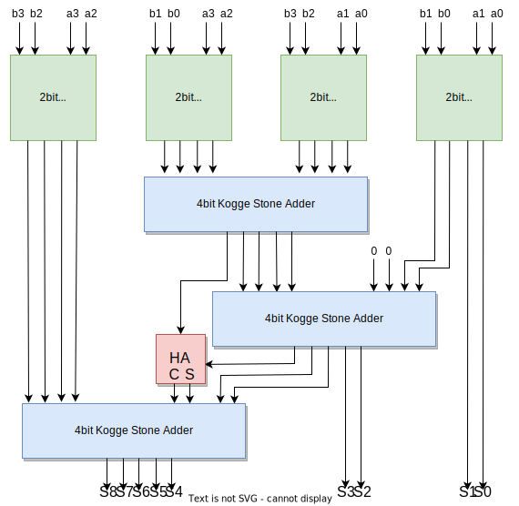
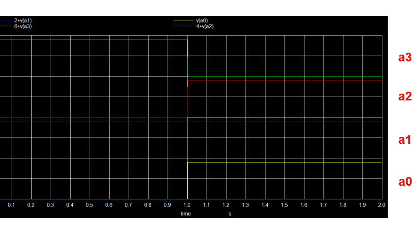
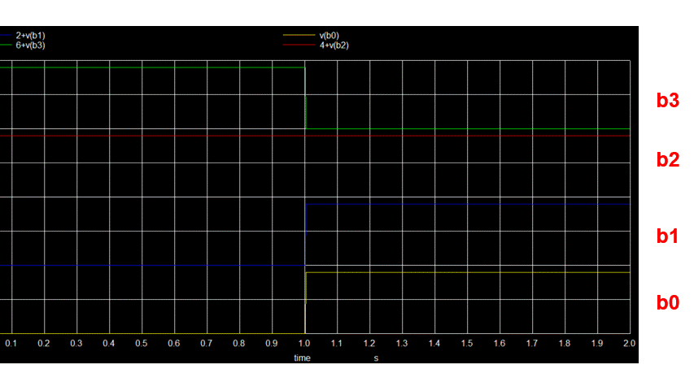
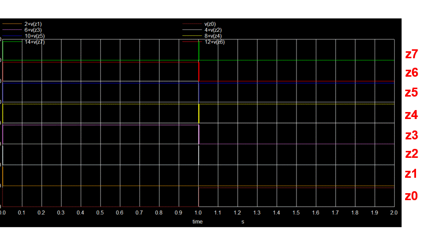

# Tool Used

### eSim

eSim (previously known as Oscad / FreeEDA) is a free/libre and open source EDA tool for circuit design, simulation, analysis and PCB design. It is an integrated tool built using free/libre and open source software such as KiCad, Ngspice, Verilator, makerchip-app, sandpiper-saas and GHDL. eSim is released under GPL.

eSim offers similar capabilities and ease of use as any equivalent proprietary software for schematic creation, simulation and PCB design, without having to pay a huge amount of money to procure licenses. Hence it can be an affordable alternative to educational institutions and SMEs. It can serve as an alternative to commercially available/licensed software tools like OrCAD, Xpedition and HSPICE.

For more details refer:
https://esim.fossee.in/home

### NgSpice

NgSpice is the open source spice simulator for electric and electronic circuits. Such a circuit may comprise of JFETs, bipolar and MOS transistors, passive elements like R, L, or C, diodes, transmission lines and other devices, all interconnected in a netlist. Digital circuits are simulated as well, event driven and fast, from single gates to complex circuits. And you may enter the combination of both analog and digital as a mixed-signal circuit.

For more details refer:
http://ngspice.sourceforge.net/docs.html

### Makerchip

It is an Online Web Browser IDE for Verilog/System-verilog/TL-Verilog Simulation. 

For More Details Refer:
https://www.makerchip.com/

### Verilator

It is a tool which converts Verilog code to C++ objects. 

For More Details Refer:
https://www.veripool.org/verilator/


# 4bit Vedic_Multiplier with Kogge Stone PPA

- Urdhva Tiryagbhyam sutra which is the general formula applicable to all cases of multiplication .“Urdhva” and “Tiryagbhyam” words are derived from Sanskrit literature. Urdhva means “Vertically” and Tiryagbhyam means “crosswise”. It is based on a novel concept, where the generation of all intermediates can be done with the concurrent addition of partial products. 
- Let's take an example of multipling two 2-digit number 25 and 38. These are the following steps followed in this process.
  - **Step-1**: units place digits are multiplied.   
  - **Step-2**: cross multiplication (units place of 1st number is multiplied with tens place of 2nd and vice versa and then both are added)
  - **Step-3**: tens place digits are multiplied.
Following represents all the steps in pictorial format.

- The above method is also followed when we have to deal with binary numbers. But instead of directly taking the binary digits we club multi digit into a set and follow the Urdhva Tiryagbhyam method on the set. In the following example 1110 (14) is multiplied with 1001 (9). 1110 is divided into 2 sets as 11 & 10 and similarlly 1001 to 10 & 01. Following represents all the steps in pictorial format.


**Step - 1** :


**Step - 2.1** :


**Step - 2.2** :


**Step - 3** :


## Block Diagram of 4-bit Multiplier
The block diagram of the 4bit Vedic Multiplier can be shown as follows.

<p align="center" width="100%">
     
</p>

## Components of 4-bit Multiplier 

### NOT gate with SKY130
Here the W/L ratio of PMOS to NMOS is maintained 2 (assuming mobility_of_electron/mobility_of_hole = 2) such that the rise time and fall time will be same. 
| W/L | Value |
| ----------- | ----------- |
| SC1 (PMOS) | 2 |
| SC2 (NMOS) | 1 |

<p align="center" width="100%">
     
</p>

### AND gate with SKY130
Here also the overall W/L ratio of PMOS to NMOS is maintained 2. 
| W/L | Value |
| ----------- | ----------- |
| SC1,SC4 (PMOS) | 2 |
| SC2,SC3 (NMOS) | 2 |

<p align="center" width="100%">
     
</p>

### XOR gate with SKY130
Here also the overall W/L ratio of PMOS to NMOS is maintained 2. 
| W/L | Value |
| ----------- | ----------- |
| SC1,SC2,SC5,SC6 (PMOS) | 4 |
| SC3,SC4,SC7,SC8 (NMOS) | 2 |

<p align="center" width="100%">
     
</p>

### Half Adder
Using the basic gates designed above half adder is designed.

<p align="center" width="100%">
     
</p>

### 2-bit Vedic Multiplier
This is designed with and gate and half adder, for which the schematic is shown below. Partial products are generated by four of these.
<p align="center" width="100%">
     
</p>
All the designs discussed above are done with analog components (MOSFETs).

### Kogge Stone Adder
The adder used in this is a parallel prefix version of the Carry Look Ahead Adder (CLA) i.e. Kogge Stone PPA. It is the fastest adder which focuses on design time and is said to be a good alternative for high performance applications. The speedy nature of Kogge Stone Adder (KSA) is because of minimum logic depth and restricted fan-out. In KSA, parallel advance will give scope to generate fast carry for intermediate stages. Block diagram of KSA is as follows 

<p align="center" width="100%">
     
</p>

Black and Grey circle in KSA can be implimented as shown below

<p align="center" width="100%">
     
</p>

More on KSA can be found [here](https://en.wikipedia.org/wiki/Kogge%E2%80%93Stone_adder)

This module is a complete digital module and is implimented using Verilog HDL and simulated & verified using makerchip. 
- Verilog Code for "black circle".
```verilog 
module black_circle(gi,pi,gj,pj,gk,pk);
	input gi,pi,gj,pj;
	output gk,pk;
	
	assign gk = gi | (gj & pi);
	assign pk = pi&pj;
endmodule 
```
- Verilog Code for "grey circle".
```verilog 
module grey_circle(gi,pi,gj,gk);
	input gi,pi,gj;
	output gk;
	
	assign gk = gi | (gj & pi);
endmodule 
```

- Verilog Code for "ksa 4bit adder".
```verilog 
module ksa_4bit(a,b,y);
	input [3:0] a;
	input [3:0] b;
	output [4:0] y;

	wire [3:0] g;
	wire [3:0] p;
	wire [3:0] h;

	wire g11,g12,g21,g22;
	wire p12;

	generate
		genvar i;
		for (i = 0; i < 4; i = i + 1)
		begin:pgh_block
			assign p[i] = a[i] | b[i];
			assign g[i] = a[i] & b[i];
			assign h[i] = a[i] ^ b[i];
		end
	endgenerate

	//layer - 1
	grey_circle  gc11(.gi(g[1]),.pi(p[1]),.gj(g[0]),.gk(g11));
	black_circle bc11(.gi(g[3]),.pi(p[3]),.gj(g[2]),.pj(p[2]),.gk(g12),.pk(p12));

	//layer - 2
	grey_circle  gc21(.gi(g[2]),.pi(p[2]),.gj(g11),.gk(g21));
	grey_circle  gc22(.gi(g12),.pi(p12),.gj(g11),.gk(g22));

	//sum
	assign y[0] = h[0] ^ 0;
	assign y[1] = h[1] ^ g[0];
	assign y[2] = h[2] ^ g11;
	assign y[3] = h[3] ^ g21;
	assign y[4] = g22;

endmodule 
```
This KSA is simulated in makerchip and the simulated result is as follows. The input a and b are asserted with random number by makerchip (in this example a = **0xF** and b = **0x9**) which results **0xF + 0x9 = 0x18**. Hence the KSA is verified and now we can use it in eSim for our mixed signal design. 

<p align="center" width="100%">
     
</p>

## Schematic of 4-bit multiplier with KSA
<p align="center" width="100%">
     
</p>

Here along with the previous discussed sub circuits, adc_bridge_n and dac_bridge_n have been used to interconnect between analog (all the component in partial product generator) and digital (all 3 KSAs) to convert the analog voltage to digital bits & from digital bits to analog voltage respectively. Finally the whole schematic is converted to a subcircuit for verifing it by simulation. Schematic for simulation is shown below.

<p align="center" width="100%">
     
</p>

### Simulation Results
Input for the above design:
- Input "**a**" is 10(0b1010) for t = 0 to 1 sec and then 7(0b0111) for t = 1 to 2 sec

<p align="center" width="100%">
     
</p>

- Input "**b**"  is 12(0b1100) for t = 0 to 1 sec and then 7(0b0111) for t = 1 to 2 sec 

<p align="center" width="100%">
     
</p>


Output from the above design:
- Output "**z**" is 120(0b1111000) = 10 * 12 for t = 0 to 1 sec and then 49(0b110001) = 7 * 7 for t = 1 to 2 sec

<p align="center" width="100%">
     
</p>
